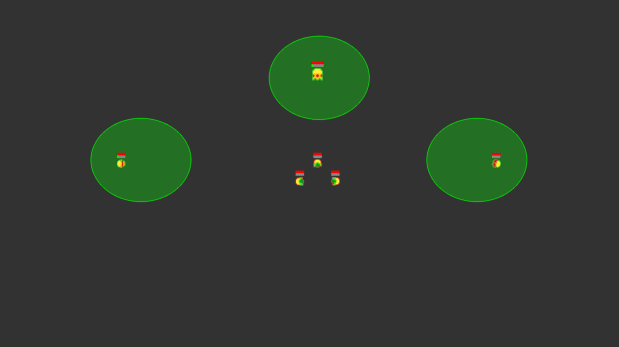
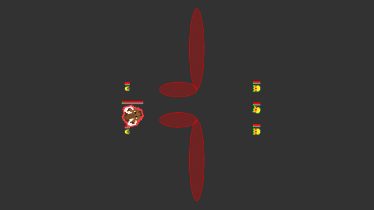
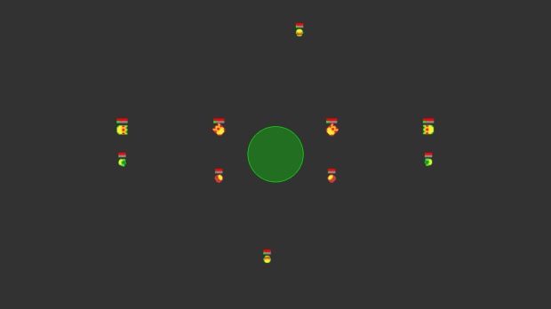
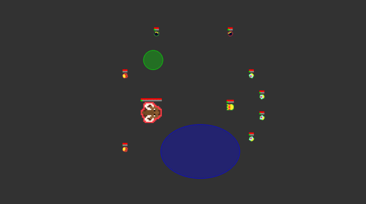
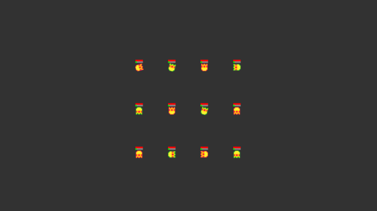
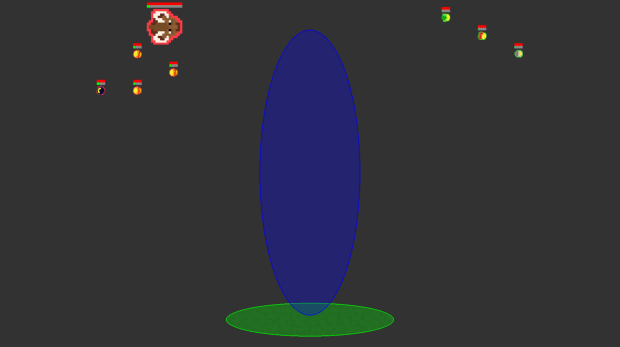
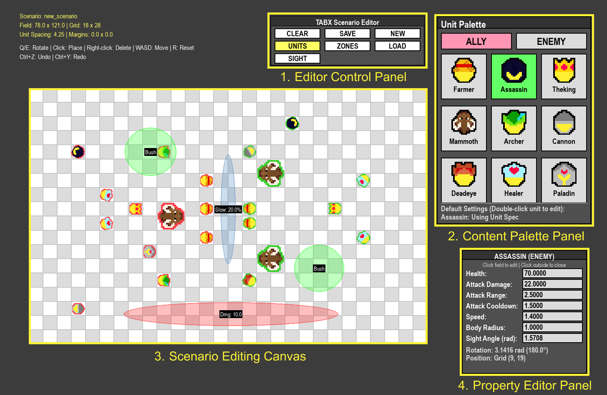

# Totally Accelerated Battle Simulator in JAX (TABX)
**Totally Accelerated Battle Simulator in JAX (TABX)** is a rapid, flexible, and easily configurable sandbox for MARL. It allows researchers to generate various scenarios tailored to specific research questions by offering a diverse set of environmental parameters.

 </img>
 </img>
 </img>
 </img>
 </img>
 </img>

We recommend using the provided `Docker devcontainer` and `uv` Python package to ensure a consistent development environment.
```
# Create a virtual environment
$ uv venv

# Activate the environment
$ uv sync
```

## Observation and Action Spaces
Each agent possesses a partial, fan-shaped observation field oriented in its facing direction, similar to a first-person perspective. Within this field, agents observe the current status (e.g., remaining health points) and specifications of all visible units. Information regarding environmental zones is provided independently of the field of view.

Based on these observations, agents select from six discrete actions: four directional movements, rotation, and an attack/heal action. The attack/heal action is only available once the unit’s cooldown period has ended.

## Non-targeting Mechanism and Zones
A distinguishing feature of TABX is its unit interaction system, which utilizes non-targeted attack and healing mechanisms. Agents execute interactions within a hurtbox—a spatial region aligned with the unit’s current heading. An interaction is successful only if a target unit is positioned within the hurtbox at the moment the action is executed.

We incorporate three environmental zones (lava, bush, and swamp). These zones dynamically modulate agent attributes, such as health and velocity, or introduce asymmetric visibility between units, forcing agents to adapt their tactics based on the terrain.

| Zone | Effect Category| Technical Impact|
|---|---|---|
|Lava |Health |Continuous damage (HP depletion)|
|Bush |Visibility |Asymmetric concealment (Stealth)|
|Swamp |Velocity |Movement speed penalty (Slow)|

## Role-Appropriate Heuristic Policy
TABX proposes a role-appropriate heuristic policy in which each unit attribute contributes an independent behavioral bias. Due to the fan-shaped field of view and non-targeting interaction model, heuristic agents adopt a "seek-and-approach" strategy as their default behavior.

To facilitate systematic classification and support the design of these agents, we define three orthogonal functional roles derived from a unit’s kinematic and combat parameters (e.g., movement speed):

- **Assassion** prioritizes targeting the opponent with the lowest health capaticy within their field of view, attempting to remain outside the target’s view field.
- **Ranger** attempts to maintain a separation from opponent of at least a fixed proportion of their attack range.
- **Healer** tracks damaged allies and position themselves at a distance while keeping patients within their hurtbox.

Role-specific attributes modulate the baseline behavior by shaping how agents position themselves during engagements.

## Rewards
- **Dense Reward**: At each timestep, agents receive a shared reward proportional to the change in health ratio difference between allied and enemy teams, incentivizing both attacks and healing.

- **Terminal Reward**: Episodes end when one team is eliminated or the step limit is reached. Winners receive +1, losers receive -1. On timeout, the team with higher average health ratio wins (ties favor the adversary to discourage evasive strategies).

## GUI Scenario Editor

 </img>

To facilitate flexible scenario design, TABX provides a Graphical User Interface (GUI) that allows users to construct custom scenarios and parameters through an intuitive visual orchestration workflow.

**Editor Components**
- **Editor Control Panel**: Provides high-level operations for managing scenarios and configuring the editor state. This includes functions for creating, loading, saving, and clearing scenarios, as well as toggles for switching editing modes and adjusting global visualization settings.
- **Content Palette Panel**: Houses the editable elements available for placement. Depending on the active editing mode, this panel displays either unit elements or environmental zone elements, allowing users to select and configure components before adding them to the workspace.
- **Scenario Editing Canvas**: The primary workspace for placing and manipulating elements. Users can interact directly with units and zones on the canvas to inspect or reposition them.
- **Property Editor Panel**: A context-sensitive interface for modifying the attributes of selected elements. The panel dynamically updates its fields based on the specific type of element selected on the canvas (e.g., adjusting a unit's health or a zone's dimensions).

```python
$ uv run src/tabx/scenario_editor.py
```

## Baseline Algorithms
We provide implementations of five MARL algorithms and five UED algorithms, available in the `baseline` directory.
| Category | Algorithm | Reference |
| --- | --- | --- |
| MARL | IPPO | De Witt et al. (2020) |
| | MAPPO | Yu et al. (2022) |
| | IQL | Tampuu et al. (2017) |
| | VDN | Sunehang et al. (2017) |
| | QMIX | Rashid et al. (2020) |
| UED | DR | Jakobi (1997); Sadeghi & Levien (2016) |
| | PLR | Jiang et al. (2021a) |
| | Robust PLR | Jiang et al. (2021b) |
| | ACCEL | Parker-Holder et al. (2022) |
| | SFL | Rutherford et al. (2024a) |

Configuration files are managed using Tyro. Every files include `wandb` logging by default. Logging can be disabled through the configuration file.